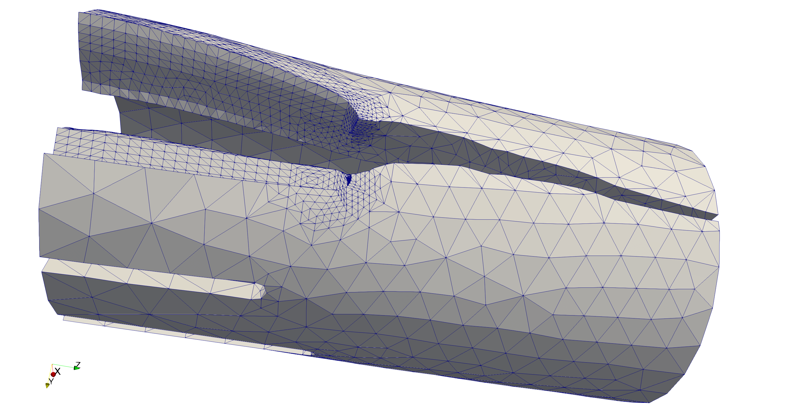

\newcommand{\tex}[1]{#1}

# Introduction and Motivation

 `MoFEM` (Mesh-oriented Finite Element Method) is a C++ library for managing
 complexities related to the finite element method (FEM). FEM is a widely
 used numerical approach for solving partial differential equations (PDEs)
 arising in various physical problems. `MoFEM` is developed to
 provide a finite element library incorporating modern approximation
 approaches and data structures for engineers, students and academics. 
 
`MoFEM` belongs to a class of open source finite element libraries, 
 such as `Deal.II` [@dealII91], `MFEM` [@doecode_1687], `libMesh` [@libMeshPaper], 
 `FEniCS` [@AlnaesBlechta2015a] and `FreeFEM++` [@MR3043640], which provide users with generic
 tools for solving PDEs and developers with frameworks for implementing 
 bespoke finite elements. `MoFEM` is specifically designed to solve complex engineering problems, enabling 
 seamless integration of meshes that comprise multiple element types and element shapes, which are typically encountered in industrial
 applications. The development of `MoFEM` has been primarily targeting the problem of 
 crack propagation for structural integrity assessment of safety critical structures 
 (see \autoref{fig:brick}).
 
 {width=60%}

 The need for solutions to increasingly complex problems demands control over
 numerical errors; otherwise, it would be difficult to distinguish discretisation
 artefacts from the real physical phenomena. A brute force approach based on
 mesh refinement (so-called *$h$-adaptivity*) leads to a low polynomial
 convergence rate and, therefore, is severely limited by the current computing
 capabilities. A more elegant approach was paved by @guo1986hp, 
 who showed that if one could simultaneously increase the
 mesh density and the interpolation order, i.e. employ *$hp$-adaptivity*,
 exponential convergence is achievable. This has been seen as the 'Holy Grail'
 of numerical methods.

 However, raising the order of approximation comes with a computational cost:
 the algebraic solver time and the matrix assembly time are increased.
 Unfortunately, there is no universal solution to tackle these two
 difficulties simultaneously. To reduce the solver time, properties of
 hierarchical and heterogeneous approximation bases, constructed using Legendre
 [@ainsworth2003hierarchic] or Jacobi [@fuentes2015orientation] polynomials,
 can be exploited. Such bases permit to increase approximation order locally and
 produce sparse and well-conditioned systems of equations. Moreover, algebraic
 systems constructed with hierarchical bases can be naturally restricted to
 lower dimensions for use as a preconditioner, e.g. with multi-grid solvers. This
 approach is ideal for elliptic problems such as solid elasticity; however,
 for hyperbolic problems the efficiency bottleneck could be in the assembly
 time, e.g. for acoustic wave propagation. In the latter case, different
 approximation bases, such as the Bernstein-Bézier basis
 [@ainsworth2011bernstein], allowing for fast numerical integration, could be
 an optimal solution. Finally, the adaptive choice of the mesh density and
 the approximation order is driven by numerical errors, which can be
 effectively estimated if error evaluators are embedded into the FE
 formulation. This leads to a family of mixed or mixed-hybrid finite elements
 that are stable if combinations of different approximation spaces
 ($\mathit{H}^1$, ${\mathbf{H}}({\textbf{curl}})$,
 ${\mathbf{H}}({\textbf{div}})$ and $\mathit{L}^2$) are used.

 `MoFEM` incorporates all solutions discussed above for $hp$-adaptivity, enabling
 rapid implementation of the finite element method, i.e. relieving the user
 from programming complexities related to bookkeeping of degrees of freedom
 (DOFs), finite elements, matrix assembly, etc. Therefore, `MoFEM` provides
 efficient tools for solving a wide range of complex engineering-related
 problems: multi-dimensional (involving solid, shell and beam elements),
 multi-domain (e.g. interaction between solid and fluid), multi-scale
 (e.g. homogenisation with FE$^2$) and multi-physics (e.g. thermo-elasticity).
 Moreover, `MoFEM` supports mixed meshes, consisting of different element
 types, for example, tetrahedra and prisms.

# Design
 
  Modern finite element software is an ecosystem that manages various complexities
  related to mesh and topology, sparse algebra and approximation, numerical integration
  and dense tensor algebra at the integration point level.  However, `MoFEM` has not
  developed all these capabilities from scratch. Instead,
  `MoFEM` integrates advanced scientific computing tools for sparse algebra from
  [`PETSc`](https://www.mcs.anl.gov/petsc/) (Portable, Extensible Toolkit for
  Scientific Computation) [@petsc-user-ref], components for handling mesh and
  topology from [`MOAB`](https://press3.mcs.anl.gov/sigma/moab-library/)
  (Mesh-Oriented Database) [@tautges_moab:2004] and data structures from [`Boost`
  libraries](https://www.boost.org) [@boost-web-page]. An illustration of how
  these packages are utilised in `MoFEM` is shown in \autoref{fig:design}. Moreover, 
  `MoFEM`'s core library is developed to manage complexities directly
  related to the finite element method. Therefore, each part of this ecosystem
  has its own design objectives, and appropriate programming tools can be selected from a
  spectrum of solutions. Resilience of the `MoFEM` ecosystem is
  ensured since the underpinning components have dynamic
  and established groups of developers and a significant number of users.
  Different components employed in the ecosystem are illustrated in \autoref{fig:ecosystem}, 
  including popular pre- and post-processing software.

  {width=100%}

  {width=70%}

  Traditional finite element codes are element-centric, i.e. the type of an
  element defines the approximation space and basis. Therefore, they are not able
  to fully exploit the potential of emerging approximation methods. On the
  contrary, the design of data structures for approximation of field variables
  in `MoFEM` is independent of the specific finite element formulation, e.g. Lagrangian,
  N\tex{\'{e}}d\tex{\'{e}}lec or Raviart-Thomas, since each finite element is
  constructed by a set of lower dimension entities on which the approximation
  fields are defined. Consequently, different approximation spaces
  ($\mathit{H}^1$, ${\mathbf{H}}({\textbf{curl}})$,
  ${\mathbf{H}}({\textbf{div}})$ and $\mathit{L}^2$) can be suitably combined in
  a finite element to create new stable mixed formulations for solving complex problems efficiently. 

  `MoFEM` data structures enable easy enrichment of approximation fields and
  modification of basis functions, for example, for resolution of singularity
  at a crack front. Applying such technique, it is almost effortless to
  construct transition elements between domains with different problem
  formulation and physics, e.g. from two-field mixed formulation to a
  single-field. One can easily implement elements with an anisotropic
  approximation order, which depends on direction in curvilinear basis, e.g.
  solid shells with arbitrary higher approximation order on the surface and
  arbitrary lower order through the thickness of the shell. This approach
  also sets a benchmark on how finite element codes could be implemented,
  introducing a concept of pipelines of *user-defined data operators* acting
  on fields that are associated with entities (vertices, edges, faces and
  volumes). Such an approach simplifies code writing, testing and validation,
  making the code more resilient to bugs.
  
  Furthermore, `MoFEM`'s core library provides functionality for developing *user
  modules* (see \autoref{fig:design}) where applications for particular
  problems can be implemented. This toolkit-like structure allows for
  independent development of modules with different repositories, owners and
  licences, being suitable for both open-access academic research and private
  industrial sensitive projects. At the same time, the `MoFEM` core library is
  licensed under the [GNU Lesser General Public
  License](https://www.gnu.org/licenses/lgpl.html) and it can be deployed and
  developed using the package manager [Spack](https://spack.io); see the [MoFEM
  installation
  instructions](http://mofem.eng.gla.ac.uk/mofem/html/installation.html) for
  more details.

# Examples and Capabilities

  `MoFEM` was initially created to solve the problem of brittle crack propagation
  using thermodynamically consistent framework [@kaczmarczyk2017energy]. 
  Over time, the domain of applications expanded to
  include computational homogenisation [@ullah2019unified],
  bone remodelling and fracture [@lew2020numerical],
  modelling of gel rheology [@richardson2018multiphysics] and acoustics
  problems. Moreover, `MoFEM` includes an extensive library of example
  applications such as soap film, solid shell, topology optimisation, phase
  field fracture, Navier-Stokes flow, cell traction microscopy, bone
  remodelling, configurational fracture, plasticity, mortar contact,
  magnetostatics and acoustic wave propagation as shown in \autoref{fig:examples}.

  {width=100%}

 `MoFEM` is designed to provide efficient tools for solving a wide variety of
  user-defined problems. In \autoref{fig:shell} an example of error-driven 
  $p$-adaptivity is presented, where a hierarchical approximation basis with
  a multi-grid solver is applied to the perforated Scordelis-Lo Roof problem 
  [@kaczmarczyk2016prism].

   

  `MoFEM` provides a convenient application programming interface allowing
  user to freely choose the approximation basis (e.g. Legrende or Jacobi
  polynomials) independently of the approximation space, and type and
  dimension of the field. A user can approximate scalar and vectorial fields on
  scalar basis functions, or vectorial and tensorial fields on vectorial bases.
  Moreover, `MoFEM` permits the construction of tensorial fields on tensorial
  bases, e.g. bubble basis of zero normal and divergence-free basis
  functions; see @gopalakrishnan2012second for an example of such a space. A `MoFEM` user can also
  freely set the approximation order on each entity of an element separately,
  e.g. edge, face, volume, or define a field on the skeleton. \autoref{fig:convergence} presents
  a convergence study for the mixed formulation of a transport/heat conduction problem; the code
  snippet below outlines the definition of approximation space, basis and order for each
  field in this example.

  ```cpp
  // add fields of fluxes and values to the mesh
  // define approximation space, basis and number of coefficients
  mField.add_field(fluxes, HDIV, DEMKOWICZ_JACOBI_BASE, 1); 
  mField.add_field(values, L2, AINSWORTH_LEGENDRE_BASE, 1); 
  // get meshset consisting of all entities in the mesh
  EntityHandle mesh_set = mField.get_moab().get_root_set();
  // add mesh entities of different type to each field
  // adding tetrahedra implies adding lower dimension entities
  mField.add_ents_to_field_by_type(mesh_set, MBTET, fluxes); 
  mField.add_ents_to_field_by_type(mesh_set, MBTET, values); 
  // define approximation order for each field 
  // separately for each entity
  mField.set_field_order(mesh_set, MBTET, fluxes, order+1); 
  mField.set_field_order(mesh_set, MBTRI, fluxes, order+1); 
  mField.set_field_order(mesh_set, MBTET, values, order);
  ```
  ![A convergence study of $h$-adaptivity for the mixed formulation of the
  stationary transport/heat conduction problem (see inset of the figure for
  the geometry) with comparison of different polynomial orders, denoted
  as $\text{P}n\text{-}\text{P}m$, where $n$ is the order of approximation for
  the flux and $m$ is the order for the field values (temperature or
  density). Note that the flux is approximated in a subspace of
  ${\mathbf{H}}(\textbf{div})$ while the field values are in a
  subspace of
  $\mathit{L}^2$ \label{fig:convergence}. 
  For more details, see the *"Mixed formulation and integration on skeleton"* tutorial
  on [@MoFEMWebPage].](LShape.pdf){width=100%}

# Conclusions 

 `MoFEM` introduces a novel architecture of FEM software, designed to exploit
 advantages of emerging finite element technologies and to enable rapid
 implementation of numerical models for complex engineering problems
 involving multi-physics and multi-scale processes.

# Acknowledgements

 `MoFEM` development has been supported by EDF Energy Nuclear Generation
 Ltd., EPSRC (grants EP/R008531/1 and EP/K026925/1), The Royal Academy of 
 Engineering (grant no. RCSRF1516\2\18) and Lord Kelvin Adam Smith programme at
 University of Glasgow.

# References
