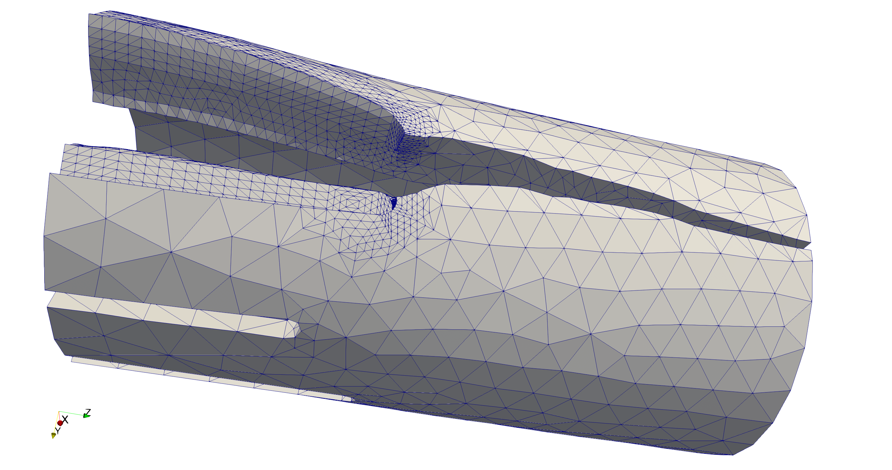

\newcommand{\tex}[1]{#1}

# Introduction and Motivation

 `MoFEM` (Mesh-oriented Finite Element Method) is a C++ library for managing
 complexities related to the finite element method (FEM). FEM is a widely used
 numerical approach for solving partial differential equations (PDEs) arising in
 various physical problems and engineering applications. `MoFEM` is developed to
 provide free and open source finite element codes, incorporating modern
 approximation approaches and data structures, for engineers, students and
 academics. It was primarily designed to solve crack propagation 
 for structural integrity assessment of safety critical structures
 (see Fig. \ref{fig:brick}).

 {width=60%}

 The need for solutions to increasingly complex problems demands control over
 numerical errors; otherwise, we will be unable to distinguish discretisation
 artefacts from the real physical phenomena. A brute force approach based on
 mesh refinement (so-called *h-adaptivity*) leads to a low polynomial
 convergence rate and, therefore, is severely limited by the current computing
 capabilities. A more elegant approach was paved by Ivo Babuska et al.
 [@babuska1992version], who showed that if one could increase simultaneously
 the mesh density and the interpolation order, i.e. employ *hp-adaptivity*, 
 exponential convergence is achievable. This has been seen as the 'Holy Grail'
 of numerical methods.

 However, raising the order of approximation comes with a computational cost: the algebraic
 solver time and the matrix assembly time are increased. Unfortunately, there is
 no universal solution to tackle these two difficulties simultaneously. To
 reduce the algebraic solver time, one method is to use multi-grid solvers, which
 can work more efficiently if a hierarchical approximation base is available,
 based on, for example, Legendre [@ainsworth2003hierarchic] or Jacobi [@fuentes2015orientation]
 polynomials. This approach is ideal for elliptic problems such as solid
 elasticity, however, for hyperbolic problems the efficiency bottleneck could be
 in the assembly time, e.g. for acoustic wave propagation. In this latter case,
 different approximation bases, such as the Bernstein-Bézier base [@ainsworth2011bernstein],
 allowing for fast numerical integration, could be an optimal solution.
 Finally, the adaptive choice of the mesh density and the approximation order is
 driven by numerical errors, which can be effectively estimated if error
 evaluators are embedded into the FE formulation. This leads to a family of
 mixed or mixed-hybrid finite elements that are stable if
 combinations of different approximation spaces ($\mathit{H}^1$,
 ${\mathbf{H}}({\textbf{curl}})$, ${\mathbf{H}}({\textbf{div}})$ and
 $\mathit{L}^2$) are used.
 
 `MoFEM` incorporates all the solutions discussed above for *hp-adaptivity*, enabling
 rapid implementation of the finite element method, i.e. relieving the user
 from programming complexities related to bookkeeping of degrees of freedom
 (DOFs), finite elements, matrix assembly, etc. Therefore, `MoFEM` provides
 efficient tools for solving a wide range of complex engineering-related
 problems: multi-dimensional (involving solid, shell and beam elements),
 multi-domain (e.g. interaction between solid and fluid), multi-scale
 (e.g. homogenisation with FE$^2$) and multi-physics (e.g. thermo-elasticity).
 Moreover, `MoFEM` supports 'mixed' meshes, consisting of different element
 types, for example, tetrahedra and prisms.

# Design

 ![Basic design of `MoFEM`. Adopted from [@MoABWebPage].\label{fig:design}](figures/basic_design.pdf){width=100%}
  
  Modern finite element software is an 'ecosystem' managing various complexities
  related to mesh and topology, sparse algebra and approximation, integration
  and dense tensor algebra at the integration point level. `MoFEM` has not
  developed and will not develop all these capabilities from scratch. Instead,
  `MoFEM` integrates advanced scientific computing tools for sparse algebra from
  [PETSc](https://www.mcs.anl.gov/petsc/) (Portable, Extensible Toolkit for
  Scientific Computation) [@petsc-web-page], components for handling mesh and
  topology from [MOAB](https://press3.mcs.anl.gov/sigma/moab-library/)
  (Mesh-Oriented Database) [@tautges_moab:2004] and data structures from [Boost
  libraries](https://www.boost.org) [@boost-web-page]. An illustration of how
  these packages are utilised in `MoFEM` is shown in Fig. \ref{fig:design}.
  Finally, `MoFEM`'s core library is developed to manage complexities directly
  related to the finite element method. Therefore, each part of this ecosystem
  has its own design objectives, and appropriate programming tools can be selected from a
  spectrum of solutions. Resilience of the `MoFEM` ecosystem is
  ensured since the underpinning components have sustainable fundings, dynamic
  and established groups of developers and significant user base. Fig.
  \ref{fig:ecosystem} shows different components that are employed in the
  ecosystem including popular pre- and post-processing software.

  !['Ecosystem' of `MoFEM`. Adopted from [@MoFEMWebPage].\label{fig:ecosystem}](figures/ecosystem.pdf){width=80%}

  Traditional finite element codes are element-centric, i.e. the type of an
  element defines the approximation space and base. Therefore, they are not able
  to fully exploit the potential of emerging approximation methods. On the
  contrary, the design of data structures for approximation of field variables
  in `MoFEM` is independent of the specific finite element, e.g. Lagrangian,
  N\tex{\'{e}}d\tex{\'{e}}lec, Raviart-Thomas, since each finite element is
  constructed by a set of lower dimension entities on which the approximation
  fields are defined. Consequently, different approximation spaces
  ($\mathit{H}^1$, ${\mathbf{H}}({\textbf{curl}})$,
  ${\mathbf{H}}({\textbf{div}})$ and $\mathit{L}^2$) can be arbitrarily mixed in
  a finite element to create new capabilities for solving complex problems
  efficiently. 

  `MoFEM` data structures enable easy enrichment of approximation fields and
  modification of base functions, for example, for resolving singularity at the
  crack front. Applying this technique, it is almost effortless to construct transition
  elements between domains with different problem formulation and physics, e.g.
  from two-field mixed formulation to a single-field, or elements with an
  anisotropic approximation order (e.g. approximation order depends on direction in curvilinear base), e.g. solid shells with arbitrary higher
  approximation order on the surface and arbitrary lower order through the
  thickness of the shell. This approach also sets the benchmark in terms of how
  finite element codes are implemented, introducing a concept of *user-defined
  data operators* acting on fields that are associated with entities (vertices,
  edges, faces and volumes) rather on the finite element directly. Such an
  approach simplifies code writing, testing and validation, making the code more
  resilient to bugs.

  Furthermore, `MoFEM` core library provides functionality for developing *user
  modules* (see Fig. \ref{fig:design}) where applications for particular
  problems can be implemented. This toolkit-like structure allows for
  independent development of modules with different repositories, owners and
  licences, being suitable for both open-access academic research and private
  industrial sensitive projects. At the same time, `MoFEM` core library is
  licensed under the [GNU Lesser General Public
  License](https://www.gnu.org/licenses/lgpl.html) and it can be deployed and
  developed using the package manager [Spack](https://spack.io), see [MoFEM
  installation
  instructions](http://mofem.eng.gla.ac.uk/mofem/html/installation.html) for
  more details.

# Examples and Capabilities

  `MoFEM` was initially created with the financial support of the Royal Academy
  of Engineering and EDF Energy to solve the problem of crack propagation [@kaczmarczyk2017energy]. Over time, the domain of
  applications expanded to include computational homogenisation (DURACOMP EPSRC
  Project EP/K026925/1), [@ullah2019unified] bone remodelling and fracture
  (Kelvin Smith Scholarship), modelling of the gel rheology
  [@richardson2018multiphysics] and acoustics problems. Moreover, `MoFEM`
  includes an extensive library of example applications such as soap film, solid
  shell, topology optimisation, phase field fracture, Navier-Stokes flow, cell
  traction microscopy, bone remodelling, configurational fracture, plasticity,
  mortar contact, magnetostatics and acoustic wave propagation as shown in Fig.
  \ref{fig:examples}.

  {width=100%}

 `MoFEM` is designed to provide efficient tools for solving a wide variety of user-defined problems.
 Fig. \ref{fig:shell} shows an example of error-driven *p-adaptivity* on
 hierarchical approximation base with a multi-grid solver applied to the
 Scordelis-Lo perforated roof problem [@kaczmarczyk2016prism]. 
 
   
  
  `MoFEM` provides a convenient application programming interface
  allowing a user to freely choose the approximation base (e.g. Legrende or
  Jacobi polynomials) independently from the approximation space, and type and
  dimension of the field. A user can approximate scalar and vectorial
  fields on scalar base functions, or vectorial and tensorial fields on
  vectorial bases. Moreover, `MoFEM` permits tensorial fields on
  tensorial bases, e.g. bubble base of zero normal and divergence free base
  functions, see example of such space in [@gopalakrishnan2012second]. A `MoFEM`
  user can freely set the approximation order on each entity of an element
  separately, e.g. edge, face, volume, or define a field on the skeleton. In
  Fig. \ref{fig:convergence} we present a convergence study for the mixed
  formulation of a transport/heat conduction problem, and below we outline a
  snippet of the code for defining approximation space, base and order for each field in
  this example:

  ```c++
  //add fields of fluxes and values to the mesh
  //define approximation space, base and number of coefficients
  CHKERR mField.add_field(fluxes,HDIV,DEMKOWICZ_JACOBI_BASE,1); 
  CHKERR mField.add_field(values,L2,AINSWORTH_LEGENDRE_BASE,1); 
  //get meshset consisting of all entities in the mesh
  EntityHandle mesh_set = mField.get_moab().get_root_set();
  //add mesh entities of different type to each field
  //adding tetrahedra implies adding lower dimension entities
  CHKERR mField.add_ents_to_field_by_type(mesh_set,MBTET,fluxes); 
  CHKERR mField.add_ents_to_field_by_type(mesh_set,MBTET,values); 
  //define approximation order for each field 
  //separately for each entity
  CHKERR mField.set_field_order(mesh_set,MBTET,fluxes,order+1); 
  CHKERR mField.set_field_order(mesh_set,MBTRI,fluxes,order+1); 
  CHKERR mField.set_field_order(mesh_set,MBTET,values,order);
  ```

  ![An *h-adaptivity* convergence study for the mixed formulation of the stationary transport/heat conduction problem (see inset of the figure for the geometry), with the comparison of different polynomial orders, denoted as '$\text{P}n\text{-}\text{P}m$', where $n$ is order of approximation for the flux and $m$ is the order for the field values (temperature or density). Note that the flux is approximated by the space ${\mathbf{H}}(\textbf{div})$, while the field values by the space $\mathit{L}^2$, see corresponding [MoFEM tutorial page](http://mofem.eng.gla.ac.uk/mofem/html/mix_transport.html) for more details.\label{fig:convergence}](figures/LShape.pdf){ width=80% }

# Conclusions 

MoFEM represents a modern type of FEM codes, designed to exploit advantages
of emerging finite element technologies, simplify application code design,
and overall enable rapid implementation of complex engineering problems,
involving several physical processes.

# Acknowledgements

`MoFEM` development has been supported by EDF Energy Nuclear Generation
Ltd., Glasgow Computational Engineering Centre (grant no. EP/R008531/1),
The Royal Academy of Engineering (grant no. RCSRF1516\2\18), DURACOMP EPSRC
Project (grant no. EP/K026925/1), and Lord Kelvin Adam Smith programme at
University of Glasgow.

# References