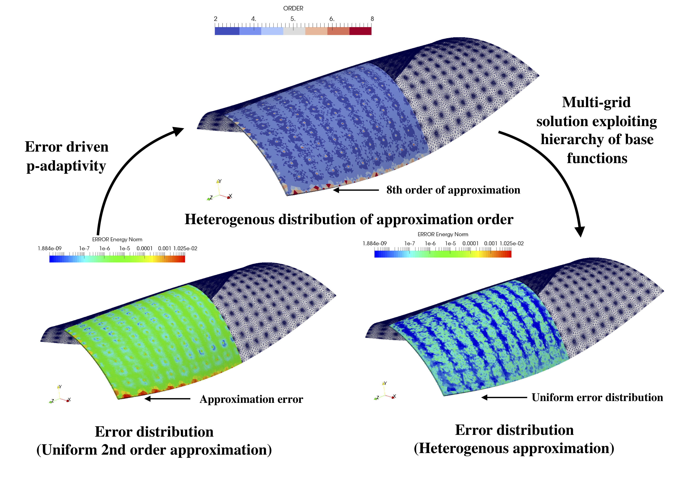
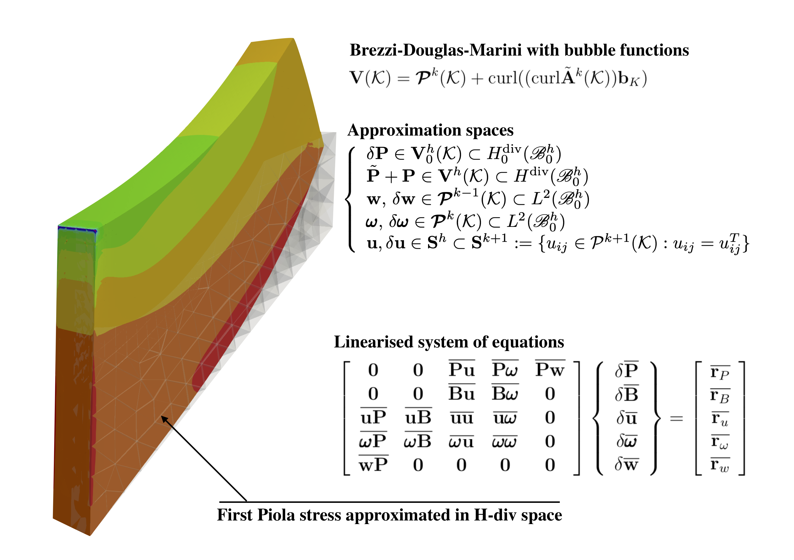

# Introduction

 `MoFEM` (Mesh-Oriented Finite Element Method) is a C++ library for managing
 complexities related to the finite element method (FEM). FEM is a widely
 used numerical approach for solving partial differential equations (PDEs)
 arising in various physical problems and engineering applications. `MoFEM`
 is developed to provide free and open source finite element codes,
 incorporating modern approximation approaches and data structures, for
 engineers, students and academics. It was primarily designed to solve crack
 propagation in nuclear graphite bricks (radiated and oxidised) used in
 Advanced Gas-cooled reactors (see Fig. \ref{fig:brick}).

 {width=80%}

# Motivation

 The need for solutions to increasingly complex problems demands control over
 numerical errors; otherwise, we will be unable to distinguish discretisation
 artefacts from the real physical phenomena. A brute force approach based on
 a pure *h-adaptivity* leads to a low polynomial convergence rate and relies
 on the machines computing power. Since we want to solve bigger and more
 complex problems, no matter how big computer we will have, it will be never
 enough. A more sophisticated approach was paved by Ivo Babuska et al.
 [@babuska1992version], who showed that if one could increase at the same
 time the polynomial order and the mesh density, i.e. employ *hp-adaptivity*,
 the exponential convergence is achievable. This has been seen as the 'Holy
 Grail' of the numerical methods.

  

 However, raising the order of approximation comes with a cost; the
 algebraic solver time and the matrix assembly time are increased. Those two
 issues can be tackled independently. Use of multi-grid solvers can reduce
 algebraic solver time exploiting a hierarchical approximation base
 [@ainsworth2003hierarchic][@fuentes2015orientation], available in MoFEM.
 This approach is ideal for elliptic problems such as solid elasticity, or
 hyperbolic equations with block solvers. However, for some problems the efficiency
 bottleneck is assembly time, e.g. acoustic wave propagation. For that case,
 different approximation bases, e.g. Bernstein-Bézier base
 [@ainsworth2011bernstein], allowing for fast numerical integration, could be
 an optimal solution. MoFEM is designed to provide tools that users can
 tackle such efficiency tradeoff and choose the optimal solution for a given
 problem. In Fig \ref{fig:shell} is shown p-adaptivity on hierarchical
 approximation base, with multi-grid solver applied to Scordelis-Lo
 perforated roof problem [@kaczmarczyk2016prism].

 The adaptive choice of mesh density and approximation order is by control of
 numerical errors. In principle, the numerical error is unknown since we do
 not know an exact solution. However, a numerical error can be estimated, and
 an efficient way of that is by embedding error evaluators in FE formulation,
 that lead to the family of the mix or mix-hybrid finite elements, which to
 satisfy stability condition uses spaces such us $H^1$,
 $\mathbf{H}\text{-}\textbf{curl}$, $\mathbf{H}\text{-}\textbf{div}$ and
 $L^2$. MoFEM provided a convenient application programming interface
 allowing user freely to chose approximation base (e.g. Legrende, Jacobi),
 independently from approximation space, and type and dimension of the field
 (e.g. field of symmetric second-order tensors). One can approximate scalar,
 vectorial fields on scalar base functions, or vectorial and tensorial fields
 on vectorial bases. The user of MoFEM can freely set approximation order on
 each entity separately (e.g. edge, face, volume), or define filed on the
 skeleton. Also, MoFEM enables users to construct tensorial field on
 tensorial bases, e.g. bubble base of zero normal and divergence free base
 functions, see example of such space in [@gopalakrishnan2012second]. The
 example of five-field mix-formulation (with tensorial bubble base) for large
 strain elasticity is presented in [@kaczmarczyk_lukasz_2019_2640903], and
 results are presented Fig. \ref{fig:mix}, where MoFEM code declaring spaces
 is as follows

 ```c++ 
auto add_hdiv_field = [&](
     const std::string field_name, const int order,
                            const int dim) {
  MoFEMFunctionBegin;
  CHKERR mField.add_field(
    field_name, HDIV, AINSWORTH_LEGENDRE_BASE, dim);
  CHKERR mField.add_ents_to_field_by_type(
    meshset, MBTET, field_name);
  CHKERR mField.set_field_order(meshset, MBTET, field_name, order);
  CHKERR mField.set_field_order(meshset, MBTRI, field_name, order);
  MoFEMFunctionReturn(0);
};

auto add_l2_field = [&](
    const std::string field_name, const int order, const int dim) {
  MoFEMFunctionBegin;
  CHKERR mField.add_field(
    field_name, L2, AINSWORTH_LEGENDRE_BASE, dim);
  CHKERR mField.add_ents_to_field_by_type(
    meshset, MBTET, field_name);
  CHKERR mField.set_field_order(meshset, MBTET, field_name, order);
  MoFEMFunctionReturn(0);
};

// Arguments are field name, field approx. order, and field rank

// Tonsorial field on vectorial base in H-div
CHKERR add_hdiv_field(piolaStress, spaceOrder, 3);
// Tonsorial field on tonsorial base
CHKERR add_bubble_field(bubbleField, spaceOrder + 1, 1);
// Field of symmetric tensor on scalar L2 base
CHKERR add_l2_field(streachTensor, spaceOrder + 1, 6);
// Vectorial fields on scalar L2 base
CHKERR add_l2_field(spatialDisp, spaceOrder - 1, 3);
CHKERR add_l2_field(rotAxis, spaceOrder, 3);
  ````

  
 

  <!-- 
  In Fig.
  \ref{fig:convergence} we show a convergence study for the mixed formulation
  for a transport/heat conduction problem.  

  ![A convergence study of h-adaptivity for the mixed formulation of the stationary transport/heat conduction problem (see inset of the figure for the geometry), with the comparison of different polynomial orders, denoted as '$\text{P}n\text{-}\text{P}m$', where $n$ is order of approximation for the flux and $m$ is the order for the field values (temperature or density). Note that the flux is approximated by the space $\mathbf{H}\text{-}\textbf{div}$, while the field values -- by the space $L^2$, see corresponding [MoFEM tutorial page](http://mofem.eng.gla.ac.uk/mofem/html/mix_transport.html) for more details.\label{fig:convergence}](LShape.pdf){ width=80% }
  -->

  `MoFEM` is designed to provide all discussed above solutions for
  *hp-adaptivity*, enabling rapid implementation of the finite element method
  for solving complex multi-dimension (e.g. solid, shell and beam elements),
  multi-domain (e.g. on part of the domain is solid on another part fluid),
  multi-scale (e.g. computer homogenisation with FE2) and multi-physics (e.g.
  thermo-elasticity) engineering problems on mix-meshes (e.g. mesh consist
  prism and tetrahedron elements). Moreover, it releases users from
  programming complexities related to the bookkeeping of degrees of freedom
  (DOFs), finite elements, matrix assembly, etc.

# Design
  
  Modern finite element software is an 'ecosystem' managing various complexities
  related to mesh and topology, sparse algebra and approximation, integration
  and dense tensor algebra at the integration point level. `MoFEM` has not
  developed and will not develop all these capabilities from scratch. Instead,
  `MoFEM` integrates advanced scientific computing tools for sparse algebra from
  [PETSc](https://www.mcs.anl.gov/petsc/) (Portable, Extensible Toolkit for
  Scientific Computation) [@petsc-web-page], components for handling mesh and
  topology from [MOAB](https://press3.mcs.anl.gov/sigma/moab-library/)
  (Mesh-Oriented Database) [@tautges_moab:2004] and data structures from [Boost
  libraries](https://www.boost.org) [@boost-web-page]. An illustration of how
  these packages are utilised in `MoFEM` is shown in Fig. \ref{fig:design}.
  Finally, `MoFEM` core library is developed to manage complexities directly
  related to the finite element method. Therefore, each part of this ecosystem
  has its own design objectives and appropriate programming tools from a
  spectrum of solutions can be selected. Resilience of `MoFEM` ecosystem is
  ensured since the underpinning components have sustainable fundings, dynamic
  and established groups of developers and significant user base. Fig.
  \ref{fig:ecosystem} shows different components that are employed in the
  ecosystem including popular pre- and post processing software.

  ![Basic design of `MoFEM` (Adopted from `MoFEM` webpage [@MoFEMWebPage]).\label{fig:design}](basic_design.pdf){width=80%}

  <!--  MoFEM makes
  PETSc integral part of code by extending PETSc by DMMOFEM interface (several
  other functions work directly on PETSc objects). MoAB from other hand is
  internal data storage.  -->

  <!--  MoFEM focuses attention on complexities related to finite element
  technology and uses abstractions like field entity, DOF (degree of freedom),
  finite element and problem. -->

  <!-- MoFEM software utilises recent advances
  in the finite element technology and modern data structures, enabling the efficient
  solution of complex, multi-domain, multi-scale and multi-physics problems.  
  -->

  Traditional finite element codes are element-centric meaning the type of an
  element defines the approximation space and base. Therefore, they are not able
  to fully exploit the potential of emerging approximation methods. On the
  contrary, the design of data structures for approximation of field variables
  in `MoFEM`  is independent of the specific finite element, e.g. Lagrangian,
  Nedelec, Rivart-Thomas, since finite element is constructed by a set of lower
  dimension entities on which the approximation fields are defined.
  Consequently, different approximation spaces ($H^1$, $\mathbf{H}\text{-}\textbf{curl}$, $\mathbf{H}\text{-}\textbf{div}$, $L^2$)
  can be arbitrarily mixed in a finite element to create new capabilities for
  solving complex problems efficiently. 
  
  <!--   
  It is worth mentioning that the
  approximation space defines the adjacency of DOFs on entities while the number
  of DOFs on entity is independent on approximation base. 
  -->

  !['Ecosystem' of `MoFEM`. Adopted from MoFEM webpage [@MoFEMWebPage].\label{fig:ecosystem}](ecosystem.png){width=80%}
   
  
 <!--  Moreover, the base on entity is a trace of the base on element,
  and opposite relation works, base on entity is extruded into element. -->

  `MoFEM` data structures enable easy enrichment of approximation fields and
  modification of base functions, for example, in case of resolving singularity
  at the crack front. Applying this technology, it is effortless to construct
  transition elements between domains with different problem formulation and
  physics, e.g. from two-field mixed formulation to single-field formulation, or
  elements with anisotropic approximation order, e.g. with arbitrary high order
  on surface and arbitrary low order through thickness of solid shells). This
  approach also sets the benchmark in terms of how finite element codes are
  implemented, introducing a concept of user-defined data operators acting on
  fields that are associated with entities (vertices, edges, faces and volumes)
  rather on the finite element directly. Such an approach simplifies code
  writing, testing and validation, making the code resilient to bugs.

  Furthermore, `MoFEM` core library provides functionality for developing user
  modules where applications for particular problems can be
  implemented. This toolkit-like structure allows for independent development of modules with different repositories, owners and licences, being suitable for both open-access academic research and private industrial sensitive projects.

  `MoFEM` is licensed under the [GNU Lesser General Public License] (https://www.gnu.org/licenses/lgpl.html), can be deployed and developed using the package manager [Spack](https://spack.io), see [MoFEM installation instructions](http://mofem.eng.gla.ac.uk/mofem/html/installation.html) for more details.

<!-- 
 ```MoFEM``` is a finite element analysis code tailored for the solution of 
 multi-physics problems with arbitrary levels of approximation, different 
 levels of mesh refinement and optimised for high-performance computing. 

 It is designed to be able to manage complexities related to hierarchical basis 
 functions (Legendre, Lobatto or Jacobi polynomials), providing heterogeneous 
 approximation of an arbitary order for L2, H1, H-div and H-curl spaces. 
 ```MoFEM``` incorporates a blend of 
 [Boost Multi-index Containers](https://www.boost.org/doc/libs/1_62_0/libs/multi_index/doc/index.html), 
 [MOAB](https://press3.mcs.anl.gov/sigma/moab-library/) (Mesh Oriented Database) 
 and [PETSc](https://www.mcs.anl.gov/petsc/) (Portable, Extensible Toolkit 
 for Scientific Computation). 
  -->
 
 <!-- `MoFEM` is developed in C++ and it is an 
 `MoFEM` can read and write a number of mesh file formats using functionality
  provided by [MOAB](https://press3.mcs.anl.gov/sigma/moab-library/). Furthemore,
  it has full support for [CUBIT/TRELIS](https://www.csimsoft.com/trelis.jsp),
  [TetGEN](http://wias-berlin.de/software/index.jsp?id=TetGen&lang=1),
  [Salome-Meca](https://www.code-aster.org/spip.php?article303), 
  [Gmsh](http://gmsh.info) for pre-processing and [ParaView](https:www.paraview.org) for post-processing. -->

# Examples

  `MoFEM` was initially created with the financial support of the Royal Academy
   of Engineering and EDF Energy to solve the problem of crack propagation in
   the nuclear graphite [@kaczmarczyk2017energy]. Over
   time, the domain of applications expanded to include computational
   homogenisation (DURACOMP EPSRC Project EP/K026925/1),
   [@ullah2019unified] bone remodelling
   and fracture (Kelvin Smith Scholarship), modelling of the gel rheology and
   acoustics problems. Moreover, `MoFEM` includes an extensive library of
   example applications such as soap film, solid shell, topology optimisation,
   phase field fracture, Navier-Stokes flow, cell traction microscopy, bone
   remodelling, configurational fracture, plasticity, mortar contact,
   magnetostatics and acoustic wave propagation as shown in Fig.
   \ref{fig:examples}.

  {width=100%}

# Acknowledgements

  `MoFEM` development has been supported by EDF Energy Nuclear Generation Ltd.
  (grant no. 4840360333), The Royal Academy of Engineering (grant no.
  RCSRF1516\2\18), DURACOMP EPSRC Project (EP/K026925/1), and Kelvin Smith
  Scholarship programme at University of Glasgow.

# References