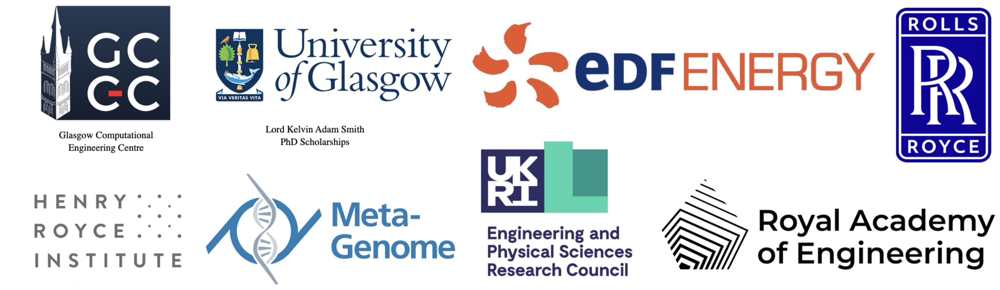

# Summary

``MoFEM`` (Mesh Oriented Finite Element Method) is a C++ library supporting the solution of finite elements problems. It is developed to provide free and openß finite element code for engineers, students and academics. ``MoFEM`` is a finite element analysis code tailored for the solution of multi-physics problems with arbitrary levels of approximation, different levels of mesh refinement and optimised for high-performance computing. It is designed to be able to manage complexities related to a heterogeneous order of approximations for L2,H1,H-div and H-curl spaces. ``MoFEM`` is the blend of the Boost MultiIndex containers, MOAB (Mesh Oriented Database)  and PETSc (Portable, Extensible Toolkit for Scientific Computation). ``MoFEM`` is developed in C++ and it is open-source software under the GNU Lesser General Public License.
``MoFEM`` can read and write a number of mesh file formats using functionality provided by MoAB. The current version of MoFEM has full support for CUBIT/TRELIS, TetGEN, Salome/Code_Aster (MED format) for pre-processing and ParaView for post-processing.

# Example users modules

Users modules implemented with ``MoFEM``.

Example results of (starting from top left): soap film, solid shell, topology optimisation, phase field fracture, navier stokes, cell traction microscopy, bone remodelling,  configurational fracture, plasticity, mortar contact, magnetostatics, acoustic wave.

# Acknowledgements

# References