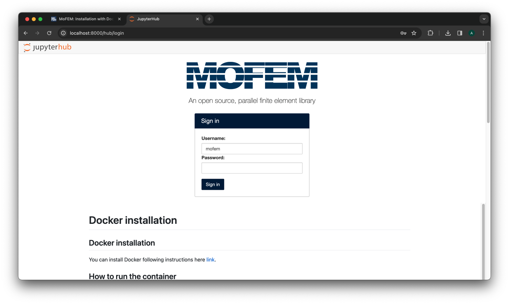
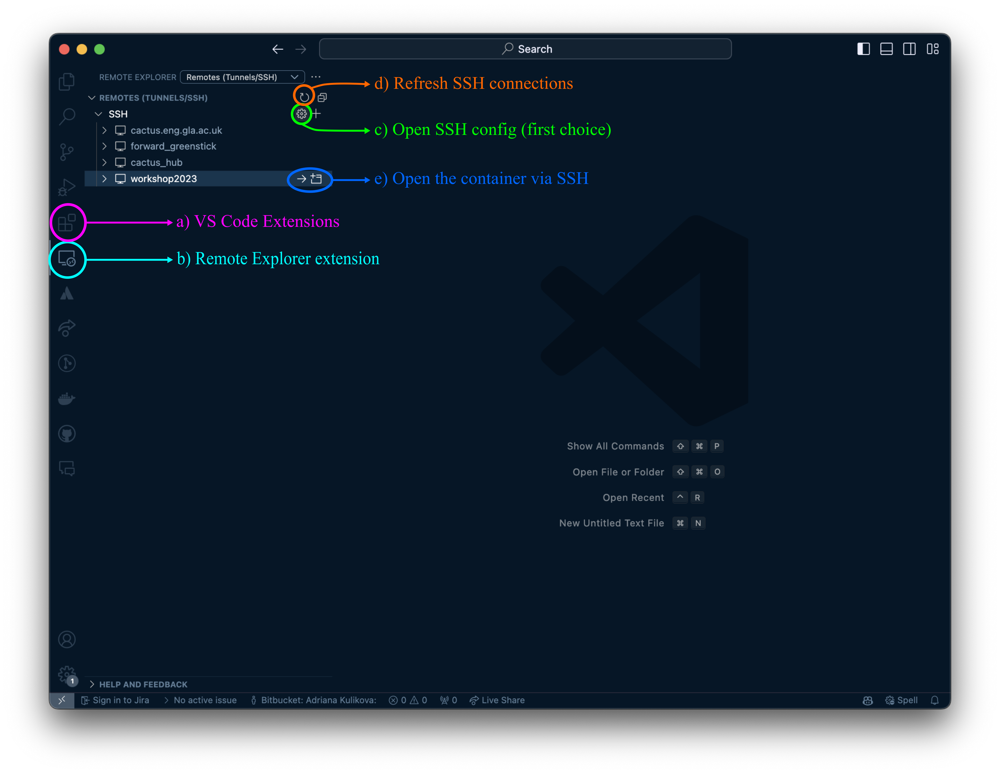
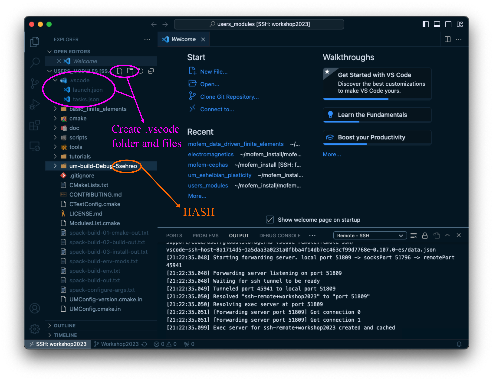

Installation with Docker - JupyterHub {#install_docker_jupyterhub}
=======================================================================

Docker is an open platform that allows for the distribution and deployment of
applications across different systems. In the context of %MoFEM it allows for
the distribution of pre-compiled libraries for the Docker platform that can
then run on any system. The Docker platform works by using the functionality provided
by the Linux kernel to provide lightweight containers and thereby avoiding the
need to run costly virtual machines. It’s through the use of containers that
%MoFEM is compiled and run.

This installation is suitable for Linux, macOS and some versions of Windows. In macOS, a lightweight Linux distribution is virtualized to run the Docker
containers in.

[TOC]

# Download and Install Docker {#docker_install}

You can download and install Docker following instructions on the [Docker installation webpage](https://docs.docker.com/installation/#installation).
> If you are using Windows you might have to set up some additional settings. For that you can follow [video with instructions](https://youtu.be/GmNNn6xiTy8) or [instructions on docker website](https://docs.docker.com/desktop/install/windows-install/) and come back to this page once Docker is running.

# How to get and run the container {#docker_getting_container}

> These instructions are for installing specific versions of %MoFEM containers. To have a more advanced installation for developers see [Installation with Docker - advanced](#install_docker).

The containers available at the moment are: 

Purpose | Image | Tag 
---|---|---
Workshop2023 | likask/mofem-spack-jupyterhub | Workshop2023
Development | likask/mofem-spack-build | latest

## Using Docker user interface

This section describes how to set up and run the Docker container within the Docker user interface. For doing this in terminal, go to the [next section](#docker_terminal_installation).

After opening Docker you should be able to see and follow similar options to the ones shown in the screenshots below, depending on the operating system and version of Docker you have.

<!--  -->

 
    
<b>Figure 1. Docker startup screen.</b>

At the top you can see a search bar and if you are connected to Internet you can search for the container you want to run. Start typing `likask/mofem-spack-jupyterhub` and you should be able to see Workshop2023 option in the tag dropdown menu next to the Image. The steps are the same for the other containers listed above, using the relevant Image and tag names.

<!--  -->

 
    
<b>Figure 2. Docker search for the relevant Image and tag.</b>

Press `Run` to pull and run the container at the same time. A popup window should appear once the image is downloaded, as in Figure 3. The download time varies with the size of the container and internet speed and may take some time.
> If the popup window doesn't appear, navigate to `Images` in the left menu and initialise the container by pressing triangle by the relevant image. 

Expand  `Optional settings` and fill the fields as shown in Figure 3. These settings set the ports for ssh and browser to connect to the JupyterHub container.

<!--  -->

 
    
<b>Figure 3. Docker container run settings - select Optional settings and fill in as above.</b>

After filling in the fields as above, press `Run`. The installed container can be found in the `Containers` section in the menu on the left. To open the container in your browser click on the second option in the `Port(s)` column of the required container or go to [http://localhost:8000](http://localhost:8000).

<!--  -->

 
    
<b>Figure 4. Stopping and starting a docker container.</b>

If you want to stop the container, you can do so from the `Actions` column on the right. Click on square to stop, and triangle to start it again.

## Using terminal {#docker_terminal_installation}

> If you used the Docker user interface for this installation, you can skip this section and continue to [Accessing the hub section](#docker_access_hub) to find login options and how to run notebooks.

For the installation using terminal, initialise Docker, open your terminal and run the following command.

1) Pull image
~~~~
docker pull likask/mofem-spack-jupyterhub:Workshop2023
~~~~
If you want to use a different image from the list of available ones, replace `likask/mofem-spack-jupyterhub:Workshop2023` by `image_name:tag_name` taken from [table listing images and tags](#docker_getting_container).

2) Run container
- If you would like to just try the container, removing the container after use, run docker as follows:
~~~~
docker run --rm --name workshop2023 -p 8000:8000 -p 2222:22 likask/mofem-spack-jupyterhub:Workshop2023
~~~~
- If you would like to switch it on for some time, we recommend running it as a daemon:
~~~~~
docker run -d --name workshop2023 -p 8000:8000 -p 2222:22 likask/mofem-spack-jupyterhub:Workshop2023
~~~~~
Once installed, you do not have to reinstall the container if it was stopped. Instead, start it again by:
~~~~~
docker start workshop2023
~~~~~

Similarly to viewing installed containers in user interface, you can view them in terminal, by running: 
~~~~~
docker container ls -a
~~~~~

- the output will let you know container names, which containers are available or running, and should look as follows:
~~~~
CONTAINER ID   IMAGE                                        COMMAND                  CREATED       STATUS         PORTS                                                    NAMES
0336cc3b5648   likask/mofem-spack-jupyterhub:Workshop2023   "/bin/bash -c 'servi…"   12 days ago   Up 2 seconds   0.0.0.0:8000->8000/tcp, 8888/tcp, 0.0.0.0:2222->22/tcp   workshop2023
~~~~

### ARM architecture case on Mac

If you have a Mac with an ARM chip, you have to switch platforms when you run docker:
~~~~~~
docker run -d --platform linux/amd64 --name workshop2023 -p 8000:8000 -p 2222:22 likask/mofem-spack-jupyterhub:Workshop2023
~~~~~~
That results in a suboptimal performance, however, it is a workable solution. 

> The base system of our images is Ubuntu 20.04. To compile code for *ARM* architecture, we would have to upgrade the system to Ubuntu 22.04, and then it would be possible to compile %MoFEM ecosystem for Apple Silicon. That is tested and works. However, additionally, you would have to compile Gmsh from scratch. Python pip installation for Gmsh on *ARM* architectures is not currently available. If you know how to do it, we will welcome PR from you to fix this problem.

# Accessing and running MoFEM tutorials with JupyterHub {#docker_access_hub}

## Password and login {#docker_password_login}

If you run a container locally, open [http://localhost:8000](http://localhost:8000) in your browser. Otherwise, substitute `localhost` by the name of your server. You should see a login page which looks as follows:

<!--  -->

 
    
<b>Figure 5. Landing page of %MoFEM in JupyterHub.</b>

- The default login name is *mofem*
- On the first login, the password you input will be your password from then onwards. 
Note this is the password to JupyterHub, not a password to the Linux environment.

> If you login as `mofem` user, you will have admin right in the JupyterHub, and you can add more users there by going to `Control Panel -> Admin -> Add Users`

## Start running 

- **Important**. Before you start, open *install.md* notebook and run the only cell there. It will copy symbolic links to the executable binaries of %MoFEM installation to your directory. Ignore any warnings there.

- Navigate to any of the Jupyter notebooks within the folders in your home directory and more instructions should be included inside. 

### Being a good citizen

This is a case when the container is running on a server, and you share resources with other users.

- If you run something with multiple processes, which will run longer than 5-10 minutes, be nice, i.e. run the command as follows
~~~~
nice -n 10 mpirun -np 2 ./command_line
~~~~

You can also watch the step-by-step instructions for running container with %MoFEM and JupyterHub using Docker user interface in the following video:

 
# Development and debugging setup  

> If you wish to develop and debug in %MoFEM using the just created container, read this section. Otherwise, you are done, and you can ignore the following instructions 

Remember to have your docker container running when executing these instructions. If you have stopped the container, restart it with the triangle button of the relevant container, see Figure 4.

## Password for SSH connection to the container {#ssh_paaswd}
First of all, set up your SSH password. This is different from the one you use to access JupyterHub in the browser. To set it, run the following command from a terminal (in case you are using Docker user interface, you can open terminal by clicking on the three vertical dots in the Actions column, see Figure 4):

~~~~
docker exec -it workshop2023 /bin/bash
~~~~
where `workshop2023` is the name of your container set in `Optional settings` and can be found in the `Name` column of the Containers section. To change the password for user `mofem` run: 
~~~~
passwd mofem
~~~~
and afterwards choose a new password.

## Start installation

In your browser ([http://localhost:8000](http://localhost:8000)), login to the JupyterHub and open `install_from_source_debug` notebook and run all of the cells in it. This will checkout the source code of %MoFEM core and basic user modules including tutorials, and compile user modules. New folders will appear in your starting directory:

- `mofem_install` - contains source code
- `um_view_debug` - symbolic links to the executable binaries of the debugging version

We advise you to wait until all of the cells have been run since some of the next steps refer to directories which are newly created by running this notebook.

## Connecting to the container

We will only cover the process with using [Visual Studio Code](https://code.visualstudio.com). Start by making sure you have it installed. Figure 6 shows locations of the next steps. 

 a)  Go to `Extensions` within VS Code and install `Remote - SSH` extension. This will allow you to connect to servers or containers like the one we created. 

 b)  Open `Remote Explorer` extension

<!--  -->

 
    
<b>Figure 6. Setting up SSH connection in VS Code to the container for debugging. Follow the written instructions for  a),  b),  c),  d) and  e). </b>

 c)  Press on the gear button highlighted as  c) (you might need to hover over), open your `.ssh/config` file and copy there the following lines:
~~~~
Host workshop2023
  HostName localhost
  ForwardX11 yes
  Compression yes
  User mofem
  Port 2222
~~~~
Here, we can see the port forwarding number 2222 we set up for our container earlier.

 d)  Refresh SSH connections (you might need to hover over) to see the option to connect via SSH to the container in the `Remote Explorer` extension in VS Code.

 e)  Connect to the container in VS Code (use the [SSH password](#ssh_paaswd) you set previously) and you should see the same folders and files as you do when you open it through a web browser ([http://localhost:8000](http://localhost:8000)).

> If you are asked about the environment by VS Code during these steps, select `Linux`.

## VS Code debugging setup

To set up debugging, follow these steps:

- open `~/mofem_install/mofem-cephas/mofem/users_modules` folder through `File -> Open Folder...` 
- go to `Extensions` within VS Code, see Figure 6  a)  , and install `C/C++` and `C/C++ Extension Pack` extensions
- create `.vscode` folder, download files [launch.json](scripts/launch.json "launch.json") & [tasks.json](scripts/tasks.json "tasks.json") and place them into the `.vscode` folder, see Figure 7
- replace the hash `5sehreo` with the hash in your folder, see  `HASH` in Figure 7
- adjust the files to fit your purpose as described below Figure 7

<!--  -->

 
    
<b>Figure 7. Setting up debugging. </b>

In [launch.json](scripts/launch.json  "launch.json"), `/mofem_install/jupyter/mofem/mofem_install/mofem-cephas/mofem/users_modules/um-build-Debug-5sehreo/tutorials/vec-2/` is the folder where the executable is located and you can change it to what you want to debug. `nonlinear_elastic` is the executable name. We suggest copying and then searching for these terms to change them in all of the locations. Lastly, check which mesh (required by the flag `-file_name`) is located at the current working directory.

[tasks.json](scripts/tasks.json "tasks.json") file defines which folder should be rebuild before running your code with debugging.

## Run and debug

For this section refer to Figure 8.

- Go to the source directory, and open a cpp file with the same name as the executable you want to debug and place a  breakpoint  next to one of the lines inside one of the functions.
    - it needs to be the cpp file with the same name as the executable file you used in [launch.json](scripts/launch.json "launch.json")
- Open  Run and Debug section  
- Press  Run and Debug  button to start debugging

<!--  -->

 
    
<b>Figure 8. Debugging in VS code. </b>

This should trigger recompilation of the folder defined in [tasks.json](scripts/tasks.json "tasks.json"), start the analysis, and eventually stop at the breakpoint if everything was set correctly. You can use  controls  to navigate the debugging session. For more information see [VS Code instructions for debugging](#https://code.visualstudio.com/Docs/editor/debugging).

The same procedure can be applied for any other users you create and everyone can debug separately. 

You can also watch the step-by-step instructions for setting up MoFEM debugging within Docker container using VScode in the following video:

## Running jupyter notebooks with the amended code

To run the example notebooks with the code which was amended during debugging, new compilation will be needed. The existing symbolic links in your home directory in JupyterHub are:

- *um_view* - symbolic links to the executable binaries of the release version common to all users (does not depend on the `mofem_install` source directory in your folder)

- *um_view_debug* - symbolic links to the executable binaries of the debugging version

For running larger problems, like the ones in some of the example notebooks, using a release version is advised as it is much faster. *um_view* is a release version but not of the code which you might have amended during the debugging part of these instructions. To compile this code with a release version run the *install_from_source_release.md* notebook, located in your home folder. This will compile a new release version and create *um_view_release* folder in your home folder:

- *um_view_release* - a new folder with symbolic links to the executable binaries of the amended release version

To run the notebooks provided with the amended version of the code, replace *um_view* in the path definitions in the notebooks you want to run with *um_view_release*.

If you change the code again, do not rerun the *install_from_source_release.md* notebook. Instead, run just the last cell in *install_from_source_release.md* or run the following command in the integrated terminal when connected to the container in VS Code:

~~~~
cd ~/mofem_install/mofem-cephas/mofem/users_modules/um-build-Release-* && make -j4 install
~~~~

For developer, you may wish to have a look at these two tutorials for compiling the code and adding new modules in MoFEM:

- \ref how_to_compile_program

- \ref how_to_add_new_module_and_program

Any problems with this installation, please contact us by [mofem-group@googlegroups.com](https://groups.google.com/forum/#!forum/mofem-group).