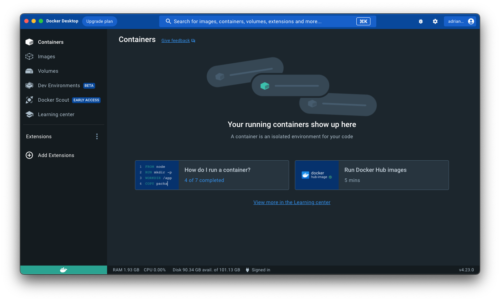
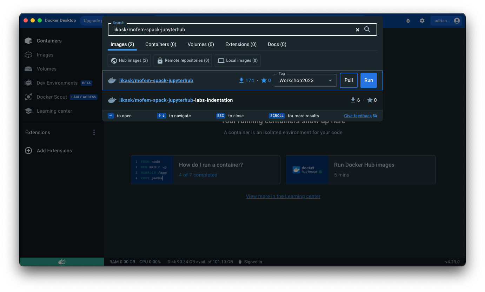
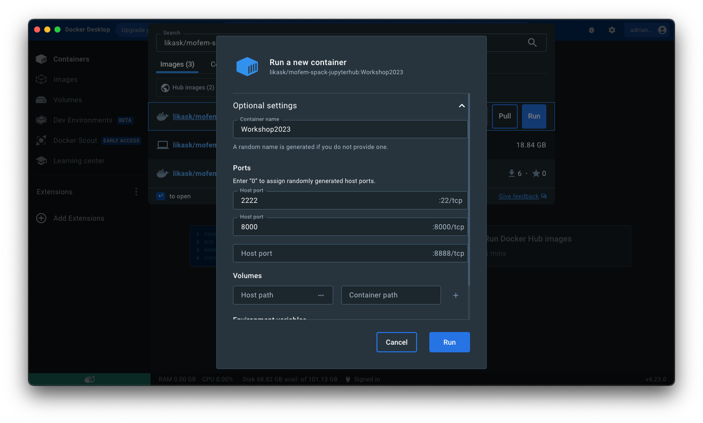
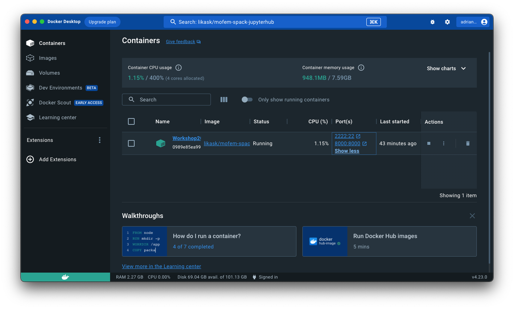

Installation with Docker (Linux, macOS and some versions of Windows) {#install_docker_user}
=======================================================================

Docker is an open platform that allows for the distribution and deployment of
applications across different systems. In the context of MoFEM it allows for
the distribution of pre-compiled libraries for the Docker platform that can
then run on any system. The Docker platform works by using facilities provided
by the Linux kernel to provide lightweight containers and thereby avoiding the
need to run costly virtual machines. It’s through the use of containers that
MoFEM is compiled and run.

In macOS, a lightweight Linux distribution is virtualized to run the Docker
containers in.

[TOC]

# Download and Install Docker {#docker_install}

You can download and install Docker following instructions on the [Docker installation webpage](https://docs.docker.com/installation/#installation).

# How to get and run the container

> These instructions are for installing specific versions of MoFEM containers. To have a more advanced installation for developers see [Installation with Docker](#install_docker).

The containers available at the moment are: 

Purpose | Image | Tag 
---|---|---
Workshop2023 | likask/mofem-spack-jupyterhub | Workshop2023
Development | likask/mofem-spack-build | latest

## Using Docker user interface

This section describes how to set up and run the Docker container within the Docker user interface. For doing this in terminal, go to the [next section](#docker_terminal_installation).

After opening Docker you should be able to see and follow the following images, dependent on the operating system and version of Docker you have.

<!--  -->

 
    
<b>Figure 1. Docker startup screen.</b>

At the top you can see a search bar and if you are connected to internet you can search for the container you want to run. Start typing `likask/mofem-spack-jupyterhub` and you should be able to see Workshop2023 option in the tag dropdown menu next to the Image. The steps are the same for the other containers listed above, searching for the relevant Image and tag names.

<!--  -->

 
    
<b>Figure 2. Docker search for the relevant Image and tag.</b>

Press `Run` to pull and run the container at the same time. A popup window should appear once everything is downloaded, as in Figure 3. The download time varies with the size of the container and internet speed and may take some time.
> If the popup window doesn't appear, navigate to `Images` in the left menu and initialise the container by pressing &#9658; by the relevant image. 

Expand  `Optional settings` and fill the fields as shown in the following Figure 3. These settings set the ports for ssh and browser to connect to the JupyterHub container.

<!--  -->

 
    
<b>Figure 3. Docker container run settings - select Optional settings and fill in as above.</b>

After filling in the fields as above, press `Run`. The installed container can be found in the `Containers` section in the menu on the left. To open the container in your browser click on the second option in the `Port(s)` column of the required container or go to [http://localhost:8000](http://localhost:8000).

<!--  -->

 
    
<b>Figure 4. Stopping and starting a docker container.</b>

If you want to stop the container, you can do so from the `Actions` column on the right. &#9209; to stop, and &#9658; to start it again. If you used this method, you can skip the next section and continue to [Accessing the hub section](#docker_access_hub) to find login options and how to run notebooks.

## Using terminal {#docker_terminal_installation}

For this section, initialise Docker, open your terminal and use the following commands.

1. Pull image
~~~~
docker pull likask/mofem-spack-jupyterhub:Workshop2023
~~~~
replace the `likask/mofem-spack-jupyterhub:Workshop2023` by required `image_name:tag_name` if needed.

2. Run container
- If you would like to just try the container, removing the container after use, run docker as follows:
~~~~
docker run --rm --name workshop2023 -p 8000:8000 -p 2222:22 likask/mofem-spack-jupyterhub:Workshop2023
~~~~
- If you would like to switch it on for some time, we recommend running it as a daemon:
~~~~~
docker run -d --name workshop2023 -p 8000:8000 -p 2222:22 likask/mofem-spack-jupyterhub:Workshop2023
~~~~~
Once installed, you do not have to reinstall it. Instead, start it again by:
~~~~~
docker start workshop2023
~~~~~

#### ARM architecture case on Mac

If you have a Mac with an ARM chip, you have to switch platforms when you run the compiler,
~~~~~~
docker run -d --platform linux/amd64 --name workshop2023 -p 8000:8000 -p 2222:22 likask/mofem-spack-jupyterhub:Workshop2023
~~~~~~
That results in a suboptimal performance, however, it is a workable solution. 

> The base system is Ubuntu 20.04. To compile code for *arm* architecture, we would have to upgrade the system to Ubuntu 22.04, and then it would be possible to compile MoFEM ecosystem for M1 chip. That is tested and works. However, additionally, you would have to compile gMesh from scratch. Python pip installation for gMesh and *arm* architectures is not available. If you know how to do it, we will welcome PR from you to fix this problem.

### How to connect to the container {#docker_connect_to_container}

- If you run a container locally, [http://localhost:8000](http://localhost:8000)
- If you install the Docker package into SSH you can attach directly to the running container as a *root* user.
- Also, you can SSH using default username `mofem` as follows
~~~~~
ssh -p 2222 mofem@localhost
~~~~~

> You can attach to the container and change `mofem` password in the shell using [passwd](https://man7.org/linux/man-pages/man1/passwd.1.html) command. To do that, you can attach to the container by:
~~~~
docker exec -it workshop2023 /bin/bash
~~~~
> and change `mofem` password with:
~~~~
passwd mofem 
~~~~ 

# Accessing and running with JupyterHub {#docker_access_hub}

## Password and login {#docker_password_login}

- The default login name is *mofem*
- On the first login, the first password you input will be you password from then onwards. 
Note this is the password to JupyterHub, not a password to the Linux environment.

You have admin rights, and you can add more users.
- (Optional) set up your shell with the command (e.g. bash):
~~~~
$ usermod --shell /bin/bash your_login_name
~~~~
You can use other shells, depending on your personal preferences.

## Start running 

- **Important**. Before you start, execute *install.md* notebook. It will copy symbolic links to the executable binaries of MoFEM installation to your directory.

- Navigate to any of the Jupyter notebooks and more instructions should be included inside. 

## Being a good citizen

This is a case when the container is running on a server, and you share resources with other users.

- If you run something with multiprocess which will run longer than 5-10 minutes, be nice, i.e. run the command as follows
~~~~
nice -n 10 mpirun -np 2 ./command_line
~~~~

# Development and debugging setup  

Copy the following code into ~/.ssh/config on your laptop or desktop. This can be used, for example, for remote connections in Visual Studio Code
~~~~
Host workshop2023
  HostName localhost
  ForwardX11 yes
  Compression yes
  User mofem
  Port 2222
~~~~

<!-- Use *workshop2023* when you log in through VSCode. Note that you are connecting to *jupyterhub cloud/docker container*. -->

## Video on JuputerHub, SSH and MoFEM

Any problems with this installation, please contact us by [mofem-group@googlegroups.com](https://groups.google.com/forum/#!forum/mofem-group).